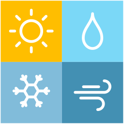

# React Weather

<div align="center">

</div>

# **프로젝트 정보**

> 1인 개발  
> 개발 기간: **2023.05.20 ~ 2023.06.22**

## 홈페이지 배포 주소

> 프론트 서버: https://react-weather.hxan.net  
> 백엔드 서버: https://apiServer.hxan.net

> 백엔드 서버는 별도의 페이지를 렌더하지 않음

## 프로젝트 소개

최초 기획은 박스오피스 API를 사용한 영화 사이트였지만, API 만료로 인해 취소됨

[기상청 단기예보 오픈 API](https://www.data.go.kr/tcs/dss/selectApiDataDetailView.do?publicDataPk=15084084)를 사용해 데이터를 서버에서 제공받아 사용자에게 UI로 상황을 나타낸다.

한산: @Hansan529 / 웹퍼블리셔 및 프론트엔드 스터디

## 프로젝트 목표

1. 현재 위치를 기반으로 기상 정보를 확인해 볼 수 있습니다.
2. 현재 기상 상태의 실황 또는 예보를 확인 할 수 있습니다.
3. 해당 페이지에 접근한 플랫폼을 구분해, 각 플랫폼에 알맞는 반응형 디자인을 구현한다.

## 코드 도우미

### 개발 환경

- react
- nodeJS
- SASS

<br>

## 사용된 언어 및 도구

### Developement


## 화면 구성

- 1024px ↑

  > 

- 1024px ↓

  > 

- 767px ↓
  > 

<br>

## 디렉토리 구조

```zsh
├── README.md
├── package.json
├── public
│   ├── images
│   │   ├── components : 반복되는 이미지
│   │   └── icons : 아이콘 이미지
│   ├── index.html
│   ├── logo192.png
│   ├── manifest.json
│   └── robots.txt
├── src
│   ├── index.js
│   ├── scripts
│   │   ├── components
│   │   │   ├── Footer.js
│   │   │   ├── Header.js
│   │   │   └── Weather.js
│   │   ├── config
│   │   │   ├── CustomElement.js
│   │   │   ├── Date.js
│   │   │   ├── Device.js
│   │   │   └── Geolocation.js
│   │   ├── routes
│   │   │   └── App.js
│   │   ├── screens
│   │   │   └── WeatherScreen.js
│   │   └── view
│   │       └── Home.js
│   └── styles
│       ├── components
│       │   └── scss
│       │       ├── Footer.module.scss
│       │       ├── Header.module.scss
│       │       ├── Weather.module.scss
│       │       └── Weather.scss
│       ├── config
│       │   ├── _reset.scss
│       │   └── _variables.scss
│       ├── routes
│       │   └── scss
│       │       └── Home.module.scss
│       ├── screens
│       │   └── scss
│       │       └── WeatherScreen.module.scss
│       └── scss
│           └── styles.scss
└── yarn.lock
```

## [업데이트 내역 (CHANGELOG)](https://github.com/Hansan529/react-weather/blob/main/CHANGELOG.md)
